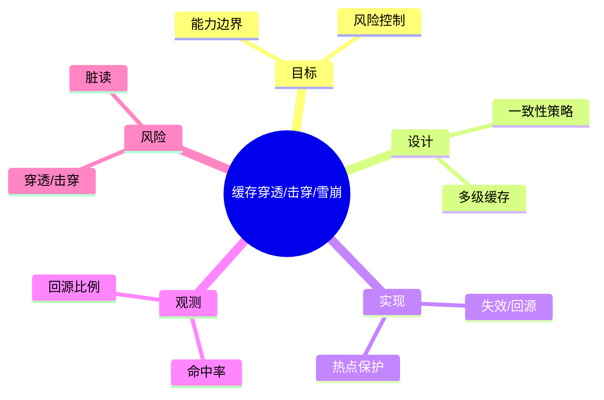

# 缓存穿透/击穿/雪崩

> 序号：0062 ｜ 主题：缓存穿透/击穿/雪崩 ｜ 目标：面向 缓存穿透/击穿/雪崩 的面试复习与工程化落地 ｜ 关键词：缓存穿透 击穿 雪崩、一致性策略、失效/回源、命中率

## 脑图


## 流程


## 关键知识
- 必会：一致性模型；失效/回写；过期策略。
- 进阶：多级缓存；热点 Key 保护；批量预热。
- 加分：语义缓存；缓存旁路；读写分离。

## 关键指标
- 命中率：基线/阈值/趋势。
- 回源比例：与容量/成本联动。

## 常见故障与排查
1. 命中率下降 → 预热/扩容
2. 穿透 → 布隆过滤
3. 击穿 → 互斥/单飞

## Java 代码示例（缓存旁路）
```java
public String get(String key) {
  String val = cache.get(key);
  if (val != null) return val;
  val = db.load(key);
  cache.put(key, val, 60);
  return val;
}
```

## 对比与取舍
- 写穿 vs 延迟双删：一致性/延迟权衡
- 本地缓存 vs 分布式缓存：延迟/一致性

|方案|优点|缺点|适用|
|---|---|---|---|
|写穿|一致性高|写放大|强一致|
|旁路|实现简单|短暂不一致|高读|

## 实战方案
1. 目标：明确业务目标与约束（延迟/成本/合规）。
2. 设计：按 一致性策略 与 多级缓存 拆分能力边界。
3. 实现：落地 失效/回源 与 热点保护，设置保护策略（超时/降级/限流）。
4. 观测：围绕 命中率 与 回源比例 建指标/告警。
5. 验证：压测+回放验证，灰度发布，必要时双写/回滚。

## 问答
1) 问：缓存穿透/击穿/雪崩中最关键的约束是什么？
   答：以目标指标为先（命中率），同时控制 穿透/击穿。追问：如何量化？→ 指标阈值+告警基线。

2) 问：如何做容量/性能基线？
   答：先压测得到吞吐/延迟曲线，再选 失效/回源 的安全水位。追问：压测不足？→ 回放生产流量。

3) 问：出现 脏读 怎么定位？
   答：先看 回源比例 与链路日志，再定位临界路径。追问：快速止损？→ 降级/限流。

4) 问：方案取舍怎么解释？
   答：依据 写穿 vs 延迟双删：一致性/延迟权衡 的业务目标选择，确保可回滚。追问：怎么回滚？→ 灰度+双写策略。

5) 问：如何保证演进可控？
   答：持续评估与 A/B，对核心指标做防回归。追问：指标抖动？→ 稳态窗口+采样。

## 思路模板
- 场景题：1) 目标与约束；2) 方案与取舍；3) 关键参数；4) 观测与压测；5) 风险与缓解；6) 演进路径。
- 排查题：资源 → 参数 → 依赖 → 拓扑/分片 → 日志/链路 → 降级/应急。

## 示例与命令
```bash
redis-cli INFO memory
```
