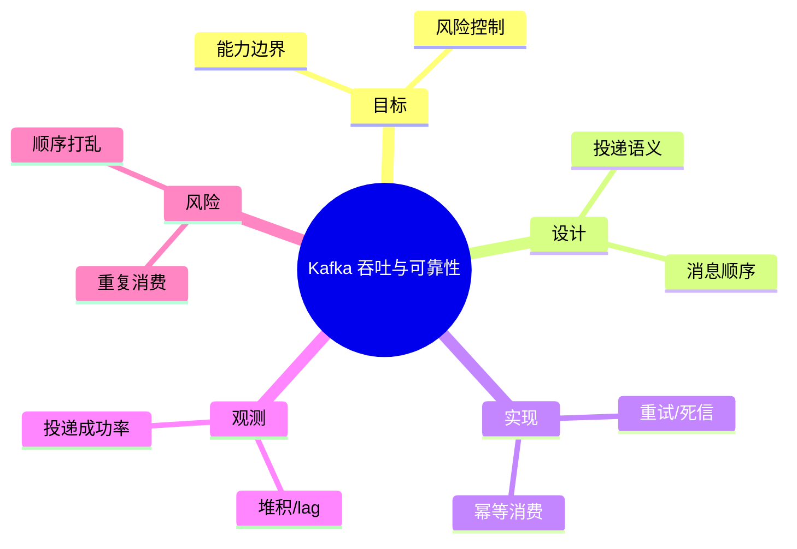

# Kafka 吞吐与可靠性

> 序号：0069 ｜ 主题：Kafka 吞吐与可靠性 ｜ 目标：面向 Kafka 吞吐与可靠性 的面试复习与工程化落地 ｜ 关键词：Kafka 吞吐与可靠性、投递语义、重试/死信、堆积/lag

## 脑图


## 流程


## 关键知识
- 必会：至少一次语义；幂等与去重；消费位点。
- 进阶：顺序队列；延迟队列；批量消费。
- 加分：压测回放；跨 Region 复制；事务消息。

## 关键指标
- 堆积/lag：基线/阈值/趋势。
- 投递成功率：与容量/成本联动。

## 常见故障与排查
1. 消费堆积 → 扩容/限流
2. 重复消费 → 幂等键
3. 顺序错乱 → 分区路由

## Java 代码示例（幂等消费）
```java
public void onMessage(Event e) {
  if (dedup.seen(e.id())) return;
  handle(e);
  dedup.mark(e.id());
}
```

## 对比与取舍
- Kafka vs RabbitMQ：吞吐 vs 延迟
- 同步投递 vs 异步投递

|方案|优点|缺点|适用|
|---|---|---|---|
|Kafka|高吞吐|顺序分区内|日志型|
|RabbitMQ|低延迟|扩展性一般|任务分发|

## 实战方案
1. 目标：明确业务目标与约束（延迟/成本/合规）。
2. 设计：按 投递语义 与 消息顺序 拆分能力边界。
3. 实现：落地 重试/死信 与 幂等消费，设置保护策略（超时/降级/限流）。
4. 观测：围绕 堆积/lag 与 投递成功率 建指标/告警。
5. 验证：压测+回放验证，灰度发布，必要时双写/回滚。

## 问答
1) 问：Kafka 吞吐与可靠性中最关键的约束是什么？
   答：以目标指标为先（堆积/lag），同时控制 重复消费。追问：如何量化？→ 指标阈值+告警基线。

2) 问：如何做容量/性能基线？
   答：先压测得到吞吐/延迟曲线，再选 重试/死信 的安全水位。追问：压测不足？→ 回放生产流量。

3) 问：出现 顺序打乱 怎么定位？
   答：先看 投递成功率 与链路日志，再定位临界路径。追问：快速止损？→ 降级/限流。

4) 问：方案取舍怎么解释？
   答：依据 Kafka vs RabbitMQ：吞吐 vs 延迟 的业务目标选择，确保可回滚。追问：怎么回滚？→ 灰度+双写策略。

5) 问：如何保证演进可控？
   答：持续评估与 A/B，对核心指标做防回归。追问：指标抖动？→ 稳态窗口+采样。

## 思路模板
- 场景题：1) 目标与约束；2) 方案与取舍；3) 关键参数；4) 观测与压测；5) 风险与缓解；6) 演进路径。
- 排查题：资源 → 参数 → 依赖 → 拓扑/分片 → 日志/链路 → 降级/应急。

## 示例与命令
```bash
kafka-consumer-groups --describe --group g1 --bootstrap-server localhost:9092
```
