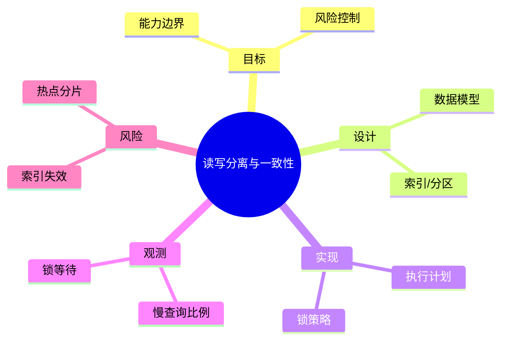

# 读写分离与一致性

> 序号：0075 ｜ 主题：读写分离与一致性 ｜ 目标：面向 读写分离与一致性 的面试复习与工程化落地 ｜ 关键词：读写分离与一致性、数据模型、执行计划、慢查询比例

## 脑图


## 流程


## 关键知识
- 必会：索引/执行计划；事务隔离；分片路由。
- 进阶：冷热分层；读写分离；分布式 ID。
- 加分：SQL 审计；自动调参；在线 DDL。

## 关键指标
- 慢查询比例：基线/阈值/趋势。
- 锁等待：与容量/成本联动。

## 常见故障与排查
1. 全表扫描 → 覆盖索引
2. 死锁 → 顺序一致
3. 延迟升高 → 优化计划

## Java 代码示例（执行计划检查）
```java
public void explain(String sql) {
  jdbc.query("EXPLAIN " + sql, rs -> {});
}
```

## 对比与取舍
- B+Tree vs Hash：范围查询 vs 点查
- 分库分表 vs 分区：水平扩展 vs 管理复杂

|方案|优点|缺点|适用|
|---|---|---|---|
|B+Tree|范围查询|写放大|OLTP|
|Hash|点查询快|不支持范围|KV|

## 实战方案
1. 目标：明确业务目标与约束（延迟/成本/合规）。
2. 设计：按 数据模型 与 索引/分区 拆分能力边界。
3. 实现：落地 执行计划 与 锁策略，设置保护策略（超时/降级/限流）。
4. 观测：围绕 慢查询比例 与 锁等待 建指标/告警。
5. 验证：压测+回放验证，灰度发布，必要时双写/回滚。

## 问答
1) 问：读写分离与一致性中最关键的约束是什么？
   答：以目标指标为先（慢查询比例），同时控制 索引失效。追问：如何量化？→ 指标阈值+告警基线。

2) 问：如何做容量/性能基线？
   答：先压测得到吞吐/延迟曲线，再选 执行计划 的安全水位。追问：压测不足？→ 回放生产流量。

3) 问：出现 热点分片 怎么定位？
   答：先看 锁等待 与链路日志，再定位临界路径。追问：快速止损？→ 降级/限流。

4) 问：方案取舍怎么解释？
   答：依据 B+Tree vs Hash：范围查询 vs 点查 的业务目标选择，确保可回滚。追问：怎么回滚？→ 灰度+双写策略。

5) 问：如何保证演进可控？
   答：持续评估与 A/B，对核心指标做防回归。追问：指标抖动？→ 稳态窗口+采样。

## 思路模板
- 场景题：1) 目标与约束；2) 方案与取舍；3) 关键参数；4) 观测与压测；5) 风险与缓解；6) 演进路径。
- 排查题：资源 → 参数 → 依赖 → 拓扑/分片 → 日志/链路 → 降级/应急。

## 示例与命令
```bash
EXPLAIN SELECT * FROM t WHERE k = ?;
```
