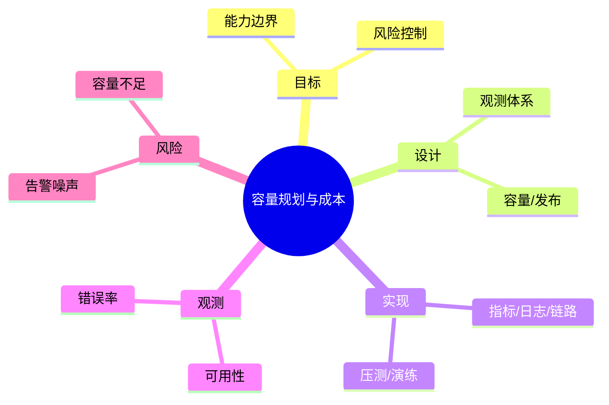

# 容量规划与成本

> 序号：0084 ｜ 主题：容量规划与成本 ｜ 目标：面向 容量规划与成本 的面试复习与工程化落地 ｜ 关键词：容量规划与成本、观测体系、指标/日志/链路、可用性

## 脑图


## 流程


## 关键知识
- 必会：指标与告警；链路追踪；容量规划。
- 进阶：回放压测；蓝绿/金丝雀；故障演练。
- 加分：自动回滚；异常归因；成本看板。

## 关键指标
- 可用性：基线/阈值/趋势。
- 错误率：与容量/成本联动。

## 常见故障与排查
1. 告警风暴 → 分级与抑制
2. 容量不足 → 预测+扩容
3. 链路缺失 → 统一规范

## Java 代码示例（Tracing 接入）
```java
@Bean
public OpenTelemetrySdk otel() {
  return OpenTelemetrySdk.builder().build();
}
```

## 对比与取舍
- Push vs Pull 指标采集
- 全量日志 vs 采样日志

|方案|优点|缺点|适用|
|---|---|---|---|
|Pull|可控|延迟|Prometheus|
|Push|实时性|复杂性|高频场景|

## 实战方案
1. 目标：明确业务目标与约束（延迟/成本/合规）。
2. 设计：按 观测体系 与 容量/发布 拆分能力边界。
3. 实现：落地 指标/日志/链路 与 压测/演练，设置保护策略（超时/降级/限流）。
4. 观测：围绕 可用性 与 错误率 建指标/告警。
5. 验证：压测+回放验证，灰度发布，必要时双写/回滚。

## 问答
1) 问：容量规划与成本中最关键的约束是什么？
   答：以目标指标为先（可用性），同时控制 告警噪声。追问：如何量化？→ 指标阈值+告警基线。

2) 问：如何做容量/性能基线？
   答：先压测得到吞吐/延迟曲线，再选 指标/日志/链路 的安全水位。追问：压测不足？→ 回放生产流量。

3) 问：出现 容量不足 怎么定位？
   答：先看 错误率 与链路日志，再定位临界路径。追问：快速止损？→ 降级/限流。

4) 问：方案取舍怎么解释？
   答：依据 Push vs Pull 指标采集 的业务目标选择，确保可回滚。追问：怎么回滚？→ 灰度+双写策略。

5) 问：如何保证演进可控？
   答：持续评估与 A/B，对核心指标做防回归。追问：指标抖动？→ 稳态窗口+采样。

## 思路模板
- 场景题：1) 目标与约束；2) 方案与取舍；3) 关键参数；4) 观测与压测；5) 风险与缓解；6) 演进路径。
- 排查题：资源 → 参数 → 依赖 → 拓扑/分片 → 日志/链路 → 降级/应急。

## 示例与命令
```bash
curl http://localhost:8080/actuator/health
```
