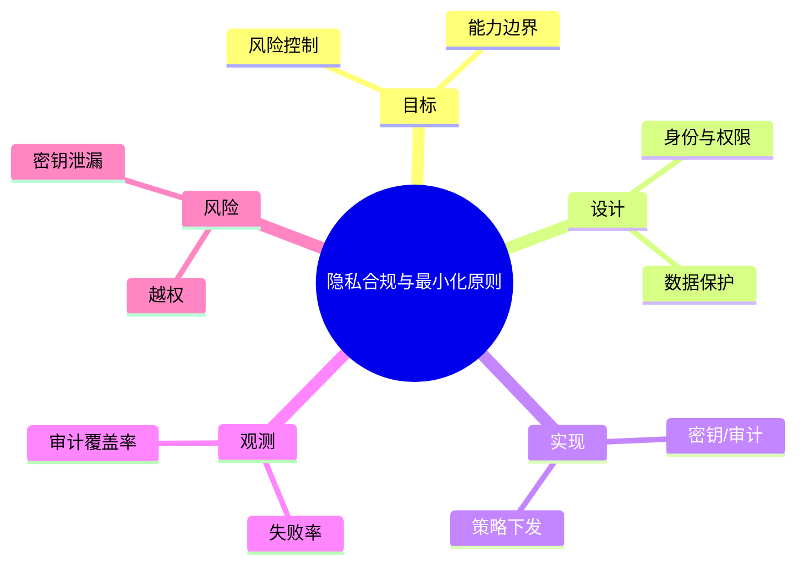

# 隐私合规与最小化原则

> 序号：0100 ｜ 主题：隐私合规与最小化原则 ｜ 目标：面向 隐私合规与最小化原则 的面试复习与工程化落地 ｜ 关键词：隐私合规与最小化原则、身份与权限、密钥/审计、失败率

## 脑图


## 流程


## 关键知识
- 必会：鉴权模型；密钥管理；数据脱敏。
- 进阶：最小权限；零信任；策略引擎。
- 加分：安全基线；合规审计；模型安全。

## 关键指标
- 失败率：基线/阈值/趋势。
- 审计覆盖率：与容量/成本联动。

## 常见故障与排查
1. 越权访问 → ABAC/上下文
2. 密钥泄漏 → 轮转/隔离
3. 日志缺失 → 强制审计

## Java 代码示例（权限校验）
```java
public void check(User u, String perm) {
  if (!u.has(perm)) throw new AccessDeniedException();
}
```

## 对比与取舍
- RBAC vs ABAC：简单 vs 细粒度
- JWT vs Session：无状态 vs 可控

|方案|优点|缺点|适用|
|---|---|---|---|
|RBAC|易理解|粒度粗|企业内部|
|ABAC|精细控制|策略复杂|多租户|

## 实战方案
1. 目标：明确业务目标与约束（延迟/成本/合规）。
2. 设计：按 身份与权限 与 数据保护 拆分能力边界。
3. 实现：落地 密钥/审计 与 策略下发，设置保护策略（超时/降级/限流）。
4. 观测：围绕 失败率 与 审计覆盖率 建指标/告警。
5. 验证：压测+回放验证，灰度发布，必要时双写/回滚。

## 问答
1) 问：隐私合规与最小化原则中最关键的约束是什么？
   答：以目标指标为先（失败率），同时控制 越权。追问：如何量化？→ 指标阈值+告警基线。

2) 问：如何做容量/性能基线？
   答：先压测得到吞吐/延迟曲线，再选 密钥/审计 的安全水位。追问：压测不足？→ 回放生产流量。

3) 问：出现 密钥泄漏 怎么定位？
   答：先看 审计覆盖率 与链路日志，再定位临界路径。追问：快速止损？→ 降级/限流。

4) 问：方案取舍怎么解释？
   答：依据 RBAC vs ABAC：简单 vs 细粒度 的业务目标选择，确保可回滚。追问：怎么回滚？→ 灰度+双写策略。

5) 问：如何保证演进可控？
   答：持续评估与 A/B，对核心指标做防回归。追问：指标抖动？→ 稳态窗口+采样。

## 思路模板
- 场景题：1) 目标与约束；2) 方案与取舍；3) 关键参数；4) 观测与压测；5) 风险与缓解；6) 演进路径。
- 排查题：资源 → 参数 → 依赖 → 拓扑/分片 → 日志/链路 → 降级/应急。

## 示例与命令
```bash
openssl rand -hex 32
```
