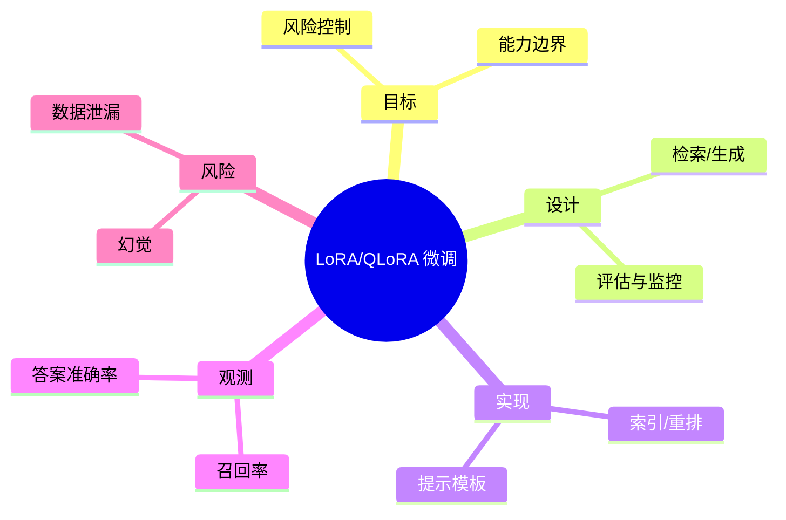

# LoRA/QLoRA 微调

> 序号：0111 ｜ 主题：LoRA/QLoRA 微调 ｜ 目标：面向 LoRA/QLoRA 微调 的面试复习与工程化落地 ｜ 关键词：LoRA QLoRA 微调、检索/生成、索引/重排、召回率

## 脑图


## 流程


## 关键知识
- 必会：RAG 基础；向量检索；提示工程。
- 进阶：重排/混合；成本控制；安全过滤。
- 加分：自动评估；多模型路由；反馈闭环。

## 关键指标
- 召回率：基线/阈值/趋势。
- 答案准确率：与容量/成本联动。

## 常见故障与排查
1. 召回不足 → 调整切分/索引
2. 成本过高 → 缓存/路由
3. 幻觉 → 约束/引用

## Java 代码示例（RAG 检索）
```java
public List<Doc> retrieve(String q) {
  List<Doc> hits = vector.search(q, 50);
  return rerank(hits, 10);
}
```

## 对比与取舍
- RAG vs 微调：时效性 vs 任务拟合
- 向量检索 vs 全文检索：语义 vs 精确

|方案|优点|缺点|适用|
|---|---|---|---|
|RAG|更新快|依赖检索|知识密集|
|微调|输出稳定|更新慢|固定领域|

## 实战方案
1. 目标：明确业务目标与约束（延迟/成本/合规）。
2. 设计：按 检索/生成 与 评估与监控 拆分能力边界。
3. 实现：落地 索引/重排 与 提示模板，设置保护策略（超时/降级/限流）。
4. 观测：围绕 召回率 与 答案准确率 建指标/告警。
5. 验证：压测+回放验证，灰度发布，必要时双写/回滚。

## 问答
1) 问：LoRA/QLoRA 微调中最关键的约束是什么？
   答：以目标指标为先（召回率），同时控制 幻觉。追问：如何量化？→ 指标阈值+告警基线。

2) 问：如何做容量/性能基线？
   答：先压测得到吞吐/延迟曲线，再选 索引/重排 的安全水位。追问：压测不足？→ 回放生产流量。

3) 问：出现 数据泄漏 怎么定位？
   答：先看 答案准确率 与链路日志，再定位临界路径。追问：快速止损？→ 降级/限流。

4) 问：方案取舍怎么解释？
   答：依据 RAG vs 微调：时效性 vs 任务拟合 的业务目标选择，确保可回滚。追问：怎么回滚？→ 灰度+双写策略。

5) 问：如何保证演进可控？
   答：持续评估与 A/B，对核心指标做防回归。追问：指标抖动？→ 稳态窗口+采样。

## 思路模板
- 场景题：1) 目标与约束；2) 方案与取舍；3) 关键参数；4) 观测与压测；5) 风险与缓解；6) 演进路径。
- 排查题：资源 → 参数 → 依赖 → 拓扑/分片 → 日志/链路 → 降级/应急。

## 示例与命令
```bash
curl -X POST http://llm-gateway/v1/chat/completions
```
