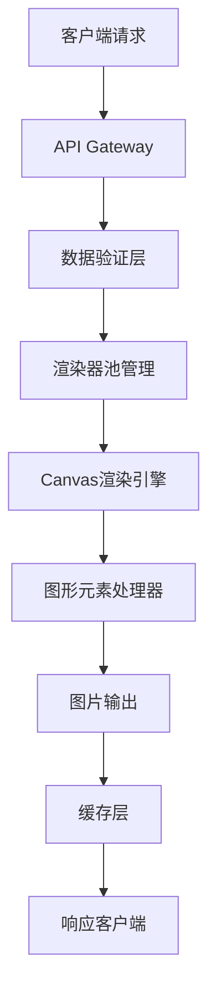

# Excalidraw API 技术设计方案

## 项目概述

本项目旨在为Excalidraw应用提供API接口，实现JSON数据输入到图片输出的转换功能。

## 技术方案选择

### 方案对比

| 方案 | 优势 | 劣势 | 选择 |
|------|------|------|------|
| Puppeteer无头浏览器 | 完全兼容原生功能 | 资源消耗高，部署复杂 | ❌ |
| Canvas服务端渲染 | 性能好，资源消耗低，部署简单 | 需要实现绘图逻辑 | ✅ |

### 最终选择：纯Canvas服务端渲染

**核心优势：**
- 无需浏览器环境
- 高性能，低资源消耗
- 高并发支持
- 部署简单

## 技术架构

### 核心技术栈
- **node-canvas**: 服务端Canvas实现
- **sharp**: 图片处理和优化
- **express**: API服务器
- **redis**: 缓存系统
- **Joi**: 数据验证

### 系统架构图



## 模块设计

### 1. ExcalidrawCanvasRenderer (核心渲染引擎)

**功能：**
- Canvas上下文管理
- 图形元素绘制
- 文本渲染
- 图片处理

**核心方法：**
```javascript
class ExcalidrawCanvasRenderer {
  async render(excalidrawData, options)
  async drawText(element)
  drawRectangle(element)
  drawEllipse(element)
  drawDiamond(element)
  drawLine(element)
  drawArrow(element)
  drawFreeDraw(element)
  drawImage(element, loadedImages)
  async loadImages(files)
  toBuffer(format, quality)
}
```

### 2. 支持的图形元素

| 元素类型 | 支持状态 | 特性 |
|----------|----------|------|
| rectangle | ✅ | 填充、边框、透明度、旋转 |
| ellipse | ✅ | 填充、边框、透明度、旋转 |
| diamond | ✅ | 填充、边框、透明度、旋转 |
| line | ✅ | 点集合、线宽、样式 |
| arrow | ✅ | 箭头、方向、样式 |
| text | ✅ | 多行、自动换行、字体、对齐 |
| image | ✅ | 缩放、裁剪、滤镜 |
| freedraw | ✅ | 平滑路径、压力感应 |
| magicframe | 🚧 | 规划中 |

### 3. 渲染器池管理

```javascript
class RendererPool {
  constructor(maxSize = 5)
  async getRenderer()
  releaseRenderer(renderer)
  async closeAll()
}
```

### 4. API接口设计

#### 主要端点

**POST /api/render**
```javascript
// 请求体
{
  "type": "excalidraw",
  "version": 2,
  "elements": [...],
  "appState": {...},
  "files": {...}
}

// 查询参数
?format=png|jpeg|webp
?quality=1-100
```

**POST /api/render/file**
- 支持文件上传方式

**GET /health**
- 健康检查

### 5. 性能优化策略

#### 缓存机制
- Redis缓存渲染结果
- 图片资源缓存
- 字体度量缓存

#### 内存管理
- 渲染器池复用
- 及时释放Canvas资源
- 垃圾回收优化

#### 渲染优化
- 元素可见性检测
- 分批渲染大文件
- 预计算布局信息

## 数据结构

### Excalidraw JSON格式

```javascript
{
  type: "excalidraw",
  version: 2,
  source: "https://excalidraw.com",
  elements: [
    {
      id: "unique-id",
      type: "rectangle|ellipse|diamond|line|arrow|text|image|freedraw",
      x: number,
      y: number,
      width: number,
      height: number,
      angle: number,
      strokeColor: string,
      backgroundColor: string,
      fillStyle: "solid|hachure|cross-hatch|transparent",
      strokeWidth: number,
      strokeStyle: "solid|dashed|dotted",
      roughness: number,
      opacity: number,
      points: [[x, y], ...], // 用于线条和自由绘制
      text: string,           // 文本内容
      fontSize: number,
      fontFamily: number,
      textAlign: "left|center|right",
      verticalAlign: "top|middle|bottom",
      containerId: string,    // 容器ID
      groupIds: string[],     // 组ID
      fileId: string,         // 图片文件ID
      isDeleted: boolean
    }
  ],
  appState: {
    gridSize: number|null,
    viewBackgroundColor: string,
    currentItemStrokeColor: string,
    zoom: { x: number, y: number },
    scrollX: number,
    scrollY: number
  },
  files: {
    "file-id": {
      id: string,
      mimeType: string,
      dataURL: string,
      created: number,
      isDeleted: boolean
    }
  }
}
```

## 部署配置

### Docker配置

```dockerfile
FROM node:18-alpine
# 安装Canvas依赖
RUN apk add --no-cache \
    cairo-dev \
    jpeg-dev \
    pango-dev \
    musl-dev \
    giflib-dev \
    pixman-dev \
    pangomm-dev \
    libjpeg-turbo-dev \
    freetype-dev
```

### 环境变量

```bash
PORT=3000
REDIS_URL=redis://localhost:6379
RENDERER_POOL_SIZE=5
CACHE_TTL=3600
MAX_REQUEST_SIZE=50mb
```

## 字体支持

### 支持的字体族
- **Virgil**: Excalidraw主要字体
- **Cascadia Code**: 代码字体
- **Assistant**: 辅助字体
- **Helvetica**: 系统默认字体

### 字体文件结构
```
fonts/
├── Virgil.woff2
├── CascadiaCode.woff2
└── Assistant-Regular.woff2
```

## 错误处理

### 常见错误类型
1. **数据验证错误**: JSON格式不正确
2. **渲染错误**: 绘制过程中的异常
3. **资源错误**: 图片加载失败
4. **系统错误**: 内存不足等

### 错误响应格式
```javascript
{
  error: "错误类型",
  message: "详细描述",
  details: ["具体错误信息"],
  timestamp: "2024-01-01T00:00:00Z"
}
```

## 监控和日志

### 关键指标
- 渲染请求数量
- 平均渲染时间
- 内存使用情况
- 缓存命中率
- 错误率

### 日志格式
```javascript
{
  timestamp: "2024-01-01T00:00:00Z",
  level: "info|warn|error",
  message: "操作描述",
  requestId: "请求ID",
  duration: 1234, // 毫秒
  metadata: {}
}
```

## 测试策略

### 单元测试
- 渲染器核心功能
- 图形元素绘制
- 数据验证
- 工具函数

### 集成测试
- API端点测试
- 文件上传功能
- 缓存机制
- 错误处理

### 性能测试
- 并发渲染测试
- 大文件处理测试
- 内存泄漏检测
- 负载测试

## 扩展计划

### 短期目标 (V1.0)
- [x] 基本图形渲染
- [x] 文本处理
- [x] 图片支持
- [ ] API服务器
- [ ] 缓存系统

### 中期目标 (V1.5)
- [ ] 粗糙效果 (roughness)
- [ ] 渐变填充
- [ ] 更多箭头样式
- [ ] SVG导出
- [ ] 批量处理

### 长期目标 (V2.0)
- [ ] 实时协作渲染
- [ ] 动画效果
- [ ] 插件系统
- [ ] 云存储集成

## 风险评估

### 技术风险
- **字体渲染差异**: 需要精确匹配原版字体
- **复杂图形算法**: 某些复杂图形可能难以完美复现
- **性能瓶颈**: 大文件处理可能较慢

### 缓解措施
- 详细的单元测试
- 性能基准测试
- 渐进式功能实现
- 完善的回退机制

## 参考资料

- [Excalidraw GitHub](https://github.com/excalidraw/excalidraw)
- [node-canvas 文档](https://github.com/Automattic/node-canvas)
- [Sharp 图像处理库](https://sharp.pixelplumbing.com/)
- [Express.js 文档](https://expressjs.com/)